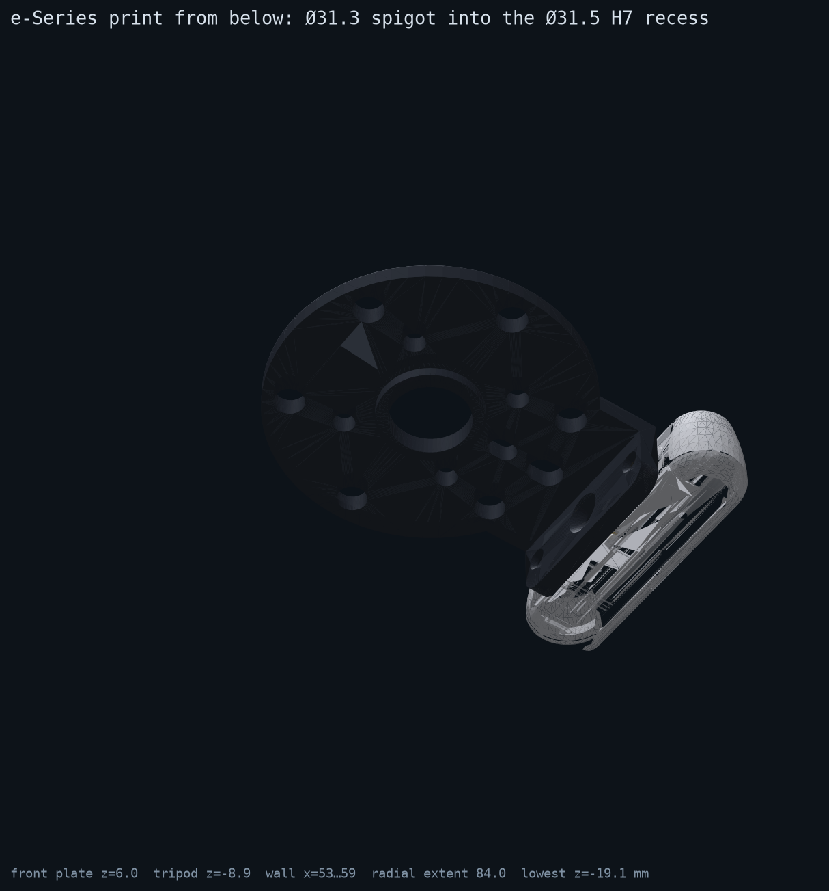
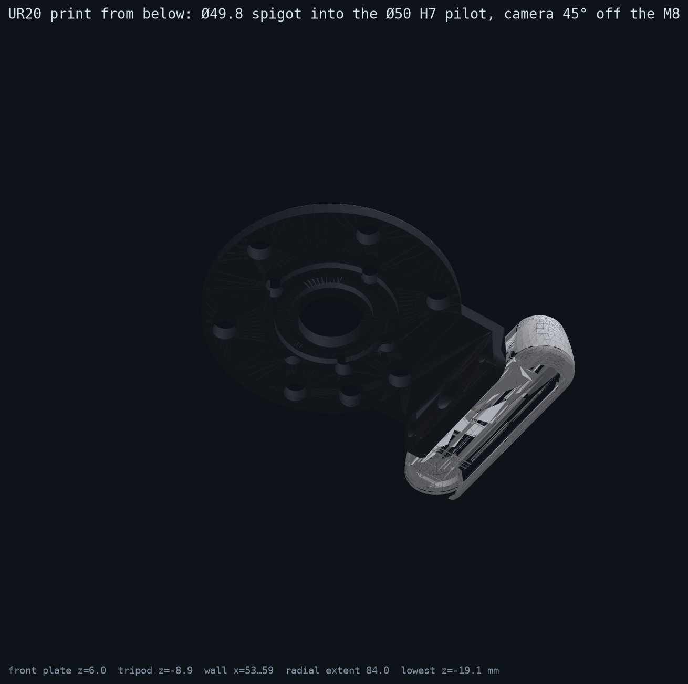
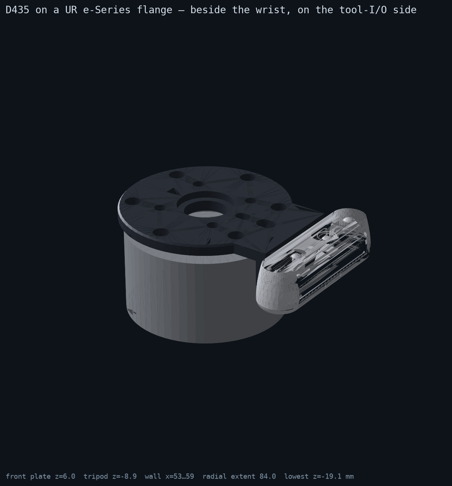
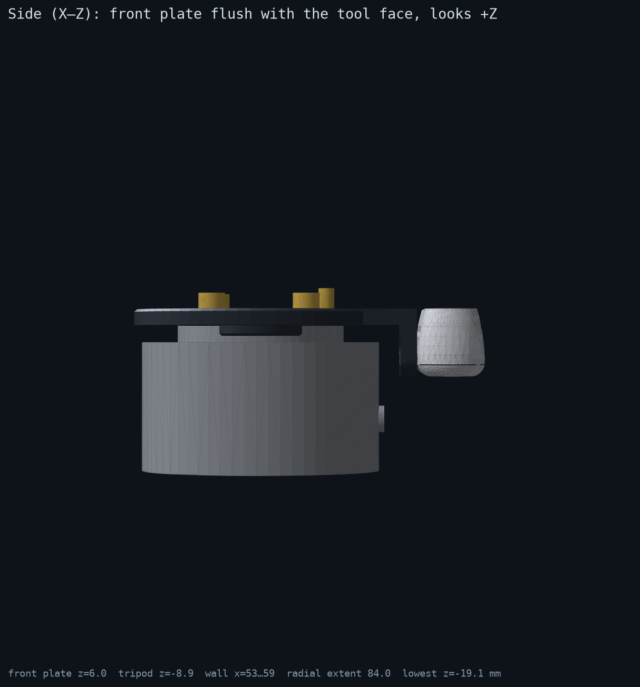
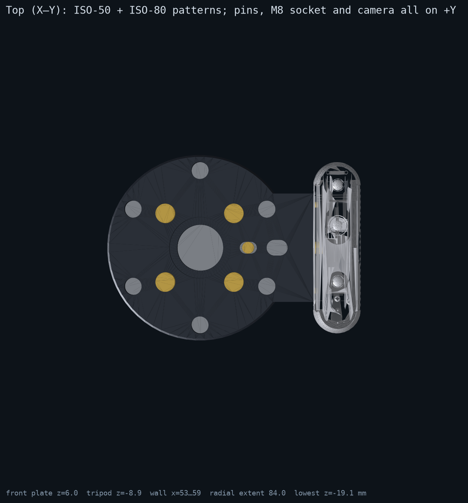
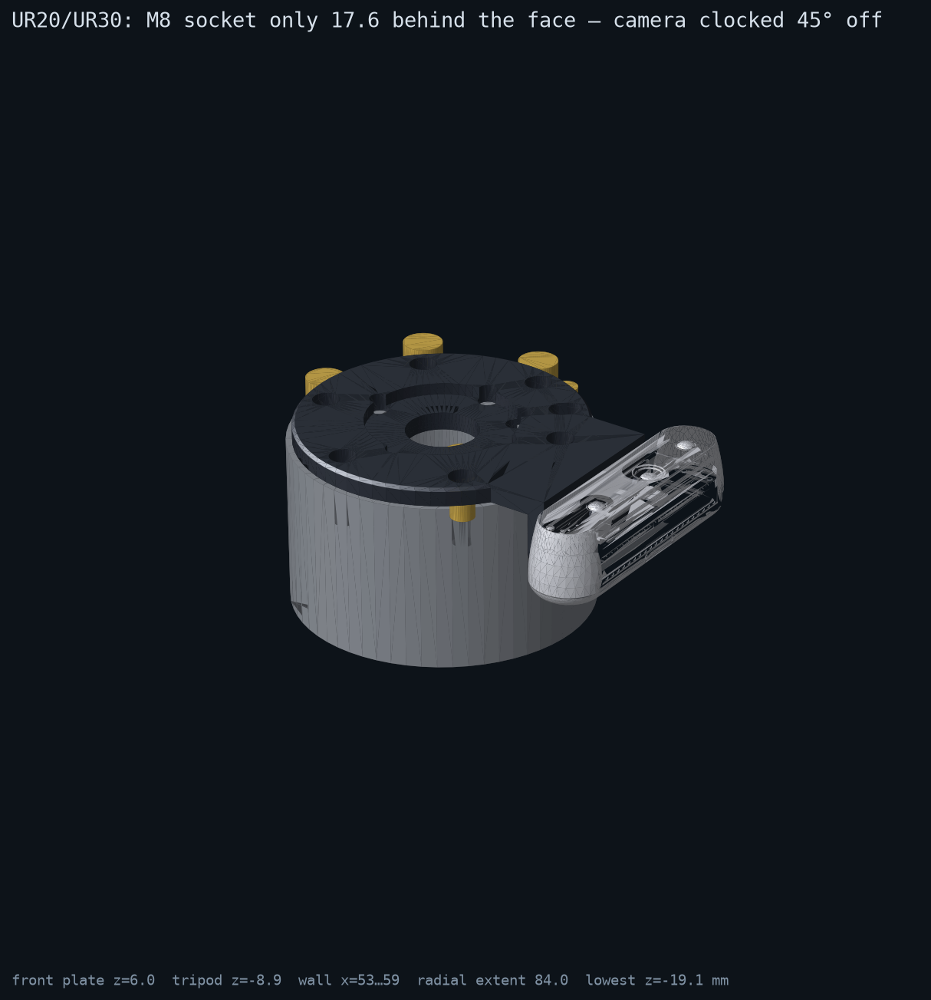
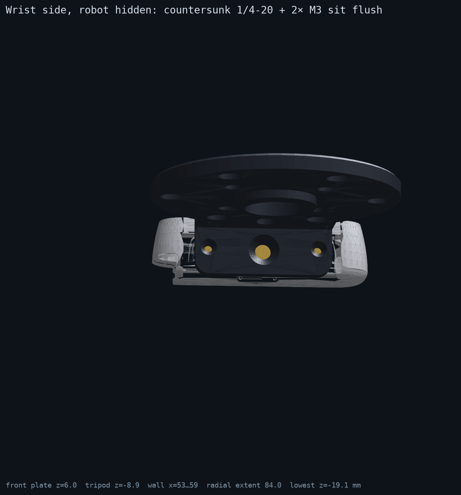

# D435 tool-flange adapter — specification / datasheet

**Part:** `d435_tool_bracket` · **Rev:** B.1 (2026-09-04, lightened: Ø96 × 6 plate, 56-wide wall, −30 % volume) · **Status:** designed, exported, *not yet printed or test-fitted*
**Files:** `bracket.py` (parametric source, CadQuery) · **two prints**, `out/d435_tool_bracket_eseries.{stl,step}` and `out/d435_tool_bracket_ur20.{stl,step}` · `out/d435_tool_bracket_assembly_{eseries,ur20}.step` (flange + adapter + camera envelope + hardware) · `out/d435_body_in_flange_frame.stl` (Intel's D435 body, placed) · `renders/*.png`

A one-piece **sandwich adapter plate** for an Intel RealSense D435 on a Universal Robots tool flange. It carries **both** the ISO 9409-1-50-4-M6 (UR3e/5e/10e/16e) and the ISO 9409-1-80-6-M8 (UR20/UR30) patterns as plain through holes, so the tool's own bolts pass through it into whichever robot it is on. The camera **hangs beside the wrist, back along −Z, on the tool-I/O connector side** (so both cables leave together), with its front plate flush with the adapter's tool face and its optical axis along flange +Z: nothing of the camera or the adapter rises into the tool's volume. The 1/4-20 and the two M3 enter through the hanging wall from the wrist side, **countersunk flush** — fit the camera to the adapter first, then bolt the adapter to the robot.

**Two variants, one design.** The base design carries both bolt patterns and is the e-Series print as-is. The UR20/UR30 print is the same file with three overrides applied on top (`variant_params`, `VARIANTS` in `bracket.py`) — nothing in the base geometry changes:

| Variant | Camera clocking | Bottom spigot | Top recess | Why |
| --- | --- | --- | --- | --- |
| `eseries` (UR3e/5e/10e/16e) | `ARM_ANGLE_DEG = 90` — on the tool-I/O side | Ø31.3 × 4 into the Ø31.5 H7 recess | Ø31.7 × 5 for an ISO-50 tool's spigot | the base design |
| `ur20` (UR20/UR30) | `UR20_ARM_ANGLE_DEG = 45` — 45° off the M8 socket (§6.10) | **+ Ø49.8 × 3 ring into the Ø50 H7 pilot** (`UR20_SPIGOT_OD`) | **Ø50.2 × 5** for an ISO-80 tool's spigot (`UR20_TOP_RECESS_D`) | pilot engagement both ways — impossible on a part that also has to sit on a Ø63 face |

Each variant is fully located on its own robot (pilot + pin + bolts) and re-presents that robot's ISO interface to the tool. The other pattern's holes are still there on both prints; they cost nothing.

| | |
| --- | --- |
|  |  |

Rev A (2026-09-02) was a Ø63 plate with a 90° arm and the camera standing *above* the plate on +X; it read as looking sideways and would have fouled any tool. Everything below replaces it.



| | |
| --- | --- |
|  |  |
|  |  |

The camera in the renders is Intel's own D435 body mesh (`vendor/`, see the NOTICE there), not a box.

## 1. Requirements (what this part must do)

| ID | Requirement | How it is met | Verified |
| --- | --- | --- | --- |
| R1 | Mount on a UR e-Series ISO 9409-1-50-4-M6 flange **and** on a UR20/UR30 ISO 9409-1-80-6-M8 flange | one Ø96 × 6 plate: 4× Ø6.6 on Ø50 PCD (45°/135°/225°/315°) + 6× Ø9 on Ø80 PCD (0°/60°/…/300°), both pin slots at 12 o'clock, Ø31.3 spigot for the e-Series Ø31.5 H7 recess | dims from the UR10e and UR20 manuals (§2) |
| R2 | Camera optical axis along flange +Z, looking away from the flange | camera bottom on a wall parallel to Z; Intel's mesh placed by its tripod boss confirms the lens plate faces +Z | render `top_xy.png`, `derived()` |
| R3 | Camera does not interfere with tooling | camera front plate **flush with the tool face** (z = 6); body and wall extend only to −Z, beside the wrist (r ≥ 53) | `side_xz.png` |
| R4 | Camera can be fitted before the adapter goes on the robot | 1/4-20 + 2× M3 from the wrist-side face, countersunk flush; 3 mm clearance to a Ø100 housing | `wrist_side.png` |
| R5 | Tool still mounts normally | all pattern holes are through holes for the tool's own bolts (+8 mm); top recess Ø31.7 × 5 re-presents the Ø31.5 pilot to an ISO-50 tool; pin slots pass the pin through to the tool | — |
| R6 | Cable exit unobstructed | USB-C is on the camera's **back face** at its left end (Intel mesh); it exits along −Z beside the wrist, where nothing is | §6 A1 |
| R7 | Printable in PPA-CF; simple enough for machining | Z-extrusions + one set of radial holes; no supports in the recommended orientation | §5 |
| R9 | Camera on the tool-I/O side, clear of the M8 plug | `ARM_ANGLE_DEG = 90` puts the wall at 12 o'clock. e-Series socket is 35.65 behind the face and the wall ends 19.05 behind it: **10.6 mm axial clearance** to a Ø12 plug. The UR20's socket is only 17.6 behind its face, so the UR20 part is clocked 45° off (`UR20_ARM_ANGLE_DEG`, 6.6° angular clearance) | `derived()["tool_connector"]`, `side_xz.png` |
| R8 | Others can iterate | every number is a named parameter in `bracket.py`; STL/STEP/renders regenerate from one command | this file |

## 2. Interfaces (the numbers that are not ours)

### 2.1 UR e-Series tool flange (UR10e User Manual SW 5.19, §8.7.5 "Securing Tool")

| Feature | Value | Note |
| --- | --- | --- |
| Standard | ISO 9409-1-50-4-M6 | identical on UR3e/5e/10e/16e |
| Flange face | Ø63 h8, proud of the Ø90 wrist by 6.50 | the Ø96 plate overhangs it |
| Bolt circle | Ø50 ±0.1, 4× M6-6H, thread depth 8 | at 45° from the dowel, 4×90° |
| Dowel hole | Ø6 H7, depth 6.20 ±0.20, on the PCD at 12 o'clock | tool-I/O connector side |
| Centring recess | Ø31.50 H7 | depth not dimensioned; spigot kept to 4 mm |
| Bolt length | "do not use bolts that extend beyond 10 mm" into the flange | ⇒ ≤ 8 mm engagement |
| Tool-I/O socket | Lumberg RKMW 8-354 (M8, 8-pin) at 12 o'clock on the Ø90 wrist, **35.65 behind the face** | UR10e manual SW 5.21 §7.11.3 drawing |

### 2.2 UR20 / UR30 tool flange (UR20 User Manual SW 5.21, 718-818-00, §8.11.3 "Securing Tool")

| Feature | Value | Note |
| --- | --- | --- |
| Standard | ISO 9409-1-80-6-M8 | UR30 datasheet: same flange |
| Flange face | Ø100 h8; the Ø100 housing continues 56.50 behind the face | drives `WRIST_R = 50` |
| Bolt circle | Ø80 ±0.1, 6× M8-6H, thread depth 17.25 | 6×60°, first hole 30° from the pin ⇒ holes at 3 and 9 o'clock |
| Pin hole | Ø8 H7, depth 8 ±0.2, on the PCD at 12 o'clock | |
| Pilot | Ø50 H7 | engaged by the `ur20` variant's Ø49.8 × 3 ring (`UR20_SPIGOT_OD`); the e-Series print leaves it off |
| Bolt length | "do not use bolts that extend beyond 17.25 mm" | |
| Tool-I/O socket | M8 at 12 o'clock on the Ø100 housing, **centreline 17.60 behind the face** | section A-A; in the wall's path — see R9 |

### 2.3 Camera: Intel RealSense D435

| Feature | Value | Source |
| --- | --- | --- |
| Envelope | 90 × 25 × 25.05 mm (length × height × depth) | datasheet 337029-017 Fig. 10-9; mesh bbox agrees |
| Tripod thread | 1/4-20 UNC on the bottom, at the length centre, **14.9 mm behind the front plate** | Intel URDF `d435_cam_mount_from_center_offset`; mesh boss at 14.91 |
| M3 mounting points | 2×, on the bottom, 45 mm apart, 14.2 mm behind the front plate; **max insertion 3 mm, 0.4 Nm** | mesh (position), datasheet (limits) |
| Depth origin | left imager, 17.5 mm to the camera's left of the tripod, at mid-height, 4.3 mm behind the front plate | Intel URDF (`0.0175`, `zero_depth_to_glass 4.2e-3` + `glass_to_front 0.1e-3`) |
| Front-plate order, camera-left → right | RGB (+32), left imager (+17.5), projector (−17.5), right imager (−32.5) | mesh window centres |
| Bottom flat | only 9 … 20.5 mm behind the front plate (front and back edges are rounded) | mesh |
| USB-C | **back face**, camera-left end (36 … 45 mm from centre) | mesh |
| Depth FOV (H×V) | 87° × 58°, RGB 69° × 42° | datasheet |
| Mass | 72 g | Intel spec page |

## 3. Geometry (all mm, from `bracket.py` PARAMS → `derived()`)

Frame: origin = centre of the flange face, +Z = away from the flange (tool direction, optical axis), +Y = towards the pin holes and the tool-I/O socket. **The camera side is on +Y too** (`ARM_ANGLE_DEG = 90`; the geometry is authored on +X and only the tab, wall and camera fasteners rotate — the plate features stay with the robot). The wall sits outside both patterns, so any angle builds; only the M8 plug limits it (R9). Positions below are for the default clocking.

| Item | Value | Parameter(s) |
| --- | --- | --- |
| Plate | **Ø96 × 6**, 1 mm chamfer on the tool-face edge (Rev B.1: was Ø100 × 8 — the ISO-80 holes only need Ø95) | `PLATE_OD`, `PLATE_T`, `PLATE_EDGE_CHAMFER` |
| ISO-50 bolt holes | 4× Ø6.6 thru on Ø50 PCD at 45°/135°/225°/315° | `BOLT50_HOLE_D`, `PCD50`, `BOLT50_ANGLES_DEG` |
| ISO-50 dowel slot | 6.2 wide × 9 long, radial, thru, at +Y r = 25 | `DOWEL50_SLOT_W/L` |
| ISO-80 bolt holes | 6× Ø9 thru on Ø80 PCD at 0°/60°/120°/180°/240°/300° | `BOLT80_HOLE_D`, `PCD80`, `BOLT80_ANGLES_DEG` |
| ISO-80 pin slot | 8.2 wide × 11 long, radial, thru, at +Y r = 40 | `DOWEL80_SLOT_W/L` |
| Spigot (bottom) | Ø31.3 × 4, ID 24, 0.8 chamfer (e-Series recess) | `SPIGOT_OD/H/CHAMFER` |
| UR20 spigot (`ur20` only) | Ø49.8 × 3 ring, 4 mm wall | `UR20_SPIGOT_OD`, `SPIGOT80_H` |
| Recess (top) | Ø31.7 × 4 (`eseries`) / Ø50.2 × 4 (`ur20`), 2 mm floor | `TOP_RECESS_D/H`, `UR20_TOP_RECESS_D` |
| Centre hole | Ø24 thru | `CENTER_HOLE_D` |
| Tab | Y = 28 … 59, X = ±28, 6 thick, R6 outer corners | `ARM_W`, `WALL_CORNER_R` |
| Wall | Y = **53 … 59**, X = ±28, Z = **−19.05 … 6** (ends at the camera's back face), R6 bottom corners | `WRIST_R`, `WALL_CLEAR`, `WALL_T`, `WALL_BELOW_CAM` |
| 1/4-20 | Ø6.6 thru the wall at X = 0, Z = **−8.9**; countersink Ø12.7 × 82° on the Y = 53 face | `TRIPOD_HOLE_D`, `TRIPOD_CSK_D/ANGLE`, `TRIPOD_FROM_FRONT` |
| M3 | 2× Ø3.4 at X = ±22.5, Z = **−8.2**; countersink Ø6.6 × 90° on the Y = 53 face | `M3_HOLE_D`, `M3_CSK_D/ANGLE`, `M3_SPACING`, `M3_FROM_FRONT` |
| Camera envelope | Y = 59 … 84, X = ±45, Z = −19.05 … **6.0** (front plate flush with the tool face) | `CAM_H/L/D`, `CAM_PROUD` |
| Radial extent / lowest point | 84 from the flange axis / z = −19.05 | `radial_extent`, `lowest_z` |
| Bracket bbox / volume / mass | `eseries`: 96 × 107 × 25 mm · **47.1 cm³** · 59 g solid PPA-CF (1.25 g/cm³), ≈ 42 g printed per §5; `ur20`: 110 × 110 × 25 · 44.2 cm³ · 55 g solid, ≈ 40 g printed. Rev B was 67.3 / 63.3 cm³: **−30 %** | `out/build_info.json` → `export.variants` |

**Nominal camera pose (hand-eye seed).** Camera axes in flange axes: `x_cam = −X`, `y_cam = −Y` (image-down points at the mounting wall), `z_cam = +Z`; camera-left is +X. Depth origin (left imager) = **(17.5, 71.5, 1.7) mm** in the flange frame for `ARM_ANGLE_DEG = 90`. (`ur20` variant, 45°: (62.9, 38.2, 1.7) — `build_info.json` → `export.variants.ur20.derived`.) This is `perception.handeye.BRACKET_NOMINAL`; calibrate to finish — a printed part will not hold ±1°.

## 4. Hardware (BOM)

| Qty | Item | Spec / note |
| --- | --- | --- |
| 4 or 6 | **The tool's own bolts, 8 mm longer** (M6 on e-Series, M8 on UR20/UR30) | the adapter has no bolts of its own; engagement limits are the flange's (≤ 8 mm e-Series, ≤ 17.25 mm UR20) |
| 1 | Dowel pin Ø6 m6 × 20 (e-Series) or Ø8 m6 × 24 (UR20) | through the slot, proud for the tool's pin hole |
| 1 | **1/4-20 UNC × 1/2" flat head, 82°** (stainless) | through the 6 mm wall → ~6.7 mm into the camera; the mesh shows a ≈ 8 mm bore, but **measure the thread depth with a pin before the first fit** (§6 A4). Torque 1.5 N·m |
| 2 | **M3 × 8 flat head, 90°** (DIN 965) | 2 mm into the camera (**max 3 mm**, 0.4 Nm) |
| — | Thread-locker (medium) on the flat heads | plastic seats relax; re-torque after 24 h |

Countersunk heads are the whole point: the wrist-side face of the wall is 3 mm from a UR20's Ø100 housing (8 mm from an e-Series wrist), so nothing may stand proud there. **Sequence: camera → adapter → robot → tool.**

## 5. Material, printing, torque

- **Material:** PPA-CF (Bambu PPA-CF / Polymaker Fiberon PPA-CF). Dry the spool (≥ 8 h at 80–100 °C). Hardened 0.4 nozzle, ~300–320 °C, bed 80–100 °C, enclosure. Alternative: PA6-CF or PET-CF.
- **Orientation: tool face on the bed** (the Ø96 face with the chamfer down, wall pointing up). Everything is then a vertical extrusion: the wall rises 25 mm from the bed, the spigot ring points up, the top recess is a 4 mm pocket in the first layers, and the three countersunk holes print as horizontal cones in the wall — no supports. Layer lines run parallel to the plate; the wall's bending load (72 g on a 25 mm lever ≈ 0.02 N·m) is negligible on a 56 × 6 section.
- **Walls/infill:** 4 perimeters, 30 % gyroid, 5 top/bottom layers, 0.2 mm layers. A 6 mm plate is then 2 mm skin + 2 mm skin + 2 mm of infill, i.e. ~75 % of solid, and the 6 mm wall is all perimeters. Expect ≈ 42 g of part and ≈ 47 g of filament with purge and brim (**≈ $10–12** at $0.20–0.26/g for Bambu PPA-CF). Don't go below 4 walls: the countersinks need the perimeters.
- **Fit tuning:** `SPIGOT_OD` (31.3) should slip into the Ø31.5 H7 recess by hand; `HOLE_PRINT_ALLOWANCE` adds to every hole if your printer undersizes (typical 0.1–0.2 with CF filaments). Countersinks are cut to the nominal head; print them 0.2 over (`TRIPOD_CSK_D`, `M3_CSK_D`) if the heads stand proud.
- **Torque (plastic joint):** tool bolts as the tool maker specifies (they clamp through the plate onto the flange — the plate is in compression only, 6 mm PPA-CF is fine). 1/4-20: 1.5 N·m. M3: 0.4 N·m (Intel).
- **Machining:** the same file mills from 6 mm aluminium plate + a bolted-on 6 mm wall, or 3-axis from a 110 × 100 × 25 block (top/bottom setups + one side op for the countersinks).

## 6. Design considerations and assumptions

1. **A1 — USB-C.** Now known from Intel's mesh: back face, camera-left end (X ≈ +36 … +45, Y ≈ 71.5 at the default clocking), exiting along −Z. A straight plug needs ~25 mm below the camera's back face (z < −17); that space is empty (wrist at r ≤ 50, camera at r ≥ 59), and the tool-I/O cable leaves 35 mm further back on the same side, so both run down the arm together. A right-angle plug is tidier. **Confirm on the unit** — Intel's mesh is the 2018 body.
2. **A2 — spigot depth.** UR's drawing does not state the e-Series recess depth; ISO 9409-1 recesses are ≥ 6 mm on the 50 flange. The 4 mm spigot leaves margin. If the plate rocks, the spigot is bottoming: shorten `SPIGOT_H`.
3. **A3 — UR20 pilot depth.** The `ur20` print's Ø49.8 ring is 3 mm tall; the UR20 drawing shows the Ø50 H7 bore as a through bore, so it cannot bottom. Its fit (`UR20_SPIGOT_OD`) is the same 0.2 print allowance as the e-Series spigot — tune after the first print. The Ø31.3 spigot is still there inside it and touches nothing on a UR20.
4. **A4 — 1/4-20 thread depth.** Intel's D435 drawing gives no max insertion for the 1/4-20 (the D455 says 9 mm); the mesh bore is ≈ 8 mm deep. The 1/2" flat head gives ~6.7 mm — measure before the first fit; a 7/16" screw or a 0.5 mm shim under the head is the fallback.
5. **Field of view.** The front plate is coplanar with the adapter's tool face, so the adapter is entirely behind the lens plane. What *will* be in view is the tool: the camera looks along +Z from y ≈ 71 mm, x ≈ 17.5 mm, so a tool body wider than ~110 mm across the camera side shadows the near field. Normal eye-in-hand; mask in perception if needed.
6. **Why both patterns on one plate.** The ISO-80 holes force the plate to Ø100; the extra ~30 g and the overhang on an e-Series are the price of one printed part that moves between the UR10e and a UR20/UR30. There is no Ø63 variant with the ISO-80 holes — they don't fit inside it; the plate is Ø100 or it isn't dual.
7. **Why the pin slots are radial.** Each flange's pilot and pin hole both define position; a round pin hole in the tool over-constrains. UR says slot it radially (both manuals).
8. **Why hang the camera, not stand it.** Rev A stood the camera 38 mm above the plate — inside the tool's volume and looking like it pointed sideways. Hanging it beside the wrist costs nothing in reach (the wrist is there anyway), keeps the lens plane at the tool face, and makes the fasteners a pre-assembly step.
9. **Stiffness.** L-section 56 × 6 tab + 56 × 6 × 25 wall, filleted; far beyond what 72 g needs. No gussets — anything on the wrist side of the wall is in the clearance zone.
10. **Tool-I/O side, and why the UR20 part is clocked.** The wall spans ±32° about its centre at r = 53 and reaches 19 mm behind the face. On an e-Series the M8 socket is 35.65 behind the face, so a straight plug (Ø12) passes 10.6 mm below the wall. On a UR20/UR30 the socket is 17.6 behind the face — the plug would be inside the wall — so `UR20_ARM_ANGLE_DEG = 45` clocks that print 45° off the connector (6.6° clear). It is the same file; only the tab/wall rotate.
11. **Safety.** Adapter + camera ≈ 115 g with the CoG ~35 mm off the flange axis and ~0 mm along Z; add it to the UR payload/CoG (`Installation → Payload`) or the torque model drifts.

## 7. Verification checklist (fill in after the first print)

- [ ] `eseries`: spigot seats in the Ø31.5 recess without rocking; note the measured spigot OD and recess depth
- [ ] `ur20`: Ø49.8 ring enters the Ø50 H7 bore by hand; ISO-80 tool spigot enters the Ø50.2 top recess
- [ ] Ø6 pin passes the inner slot; Ø8 pin passes the outer slot; plate cannot rotate
- [ ] Tool bolts (+8 mm) enter freely through the plate; torque per the tool maker
- [ ] 1/4-20 engages ≤ the measured thread depth; M3 ≤ 3 mm (depth gauge first)
- [ ] Flat heads flush or below the wrist-side face; wall clears the wrist through a full wrist-3 rotation
- [ ] USB-C plug seats with the cable running along −Z; no contact (A1)
- [ ] `perception rs-info` sees the camera; `perception gui` shows the tool where §6.5 predicts
- [ ] Hand-eye calibration result vs. the nominal (17.5, 71.5, 1.7) mm / axis map in §3
- [ ] Tool-I/O plug seats with the wall in place (e-Series: 10.6 mm predicted clearance)
- [ ] Payload updated on the pendant

## 8. Regenerating

```bash
# cadquery is a design-time tool, not a runtime dependency of this repo
uv run --with cadquery --with matplotlib --with numpy python hardware/d435-tool-bracket/bracket.py            # defaults
uv run --with cadquery --with matplotlib --with numpy python hardware/d435-tool-bracket/bracket.py SPIGOT80_OD=49.8 UR20_ARM_ANGLE_DEG=135
# re-derive the vendored Intel mesh from the pinned realsense-ros commit (network + fast-simplification)
uv run --with numpy --with fast-simplification python hardware/d435-tool-bracket/bracket.py --refresh-camera-mesh
```

Outputs land in `out/` (STL + STEP per variant, an assembly STEP per variant, the placed camera body STL, `build_info.json` with the per-variant overrides, derived numbers and the tool-connector clearance check) and `renders/`. Any `UR20_*` parameter can be overridden on the command line like the rest; the e-Series print *is* the base parameters. Sources for every external number are cited in `bracket.py`'s docstring and `vendor/NOTICE.md`.
